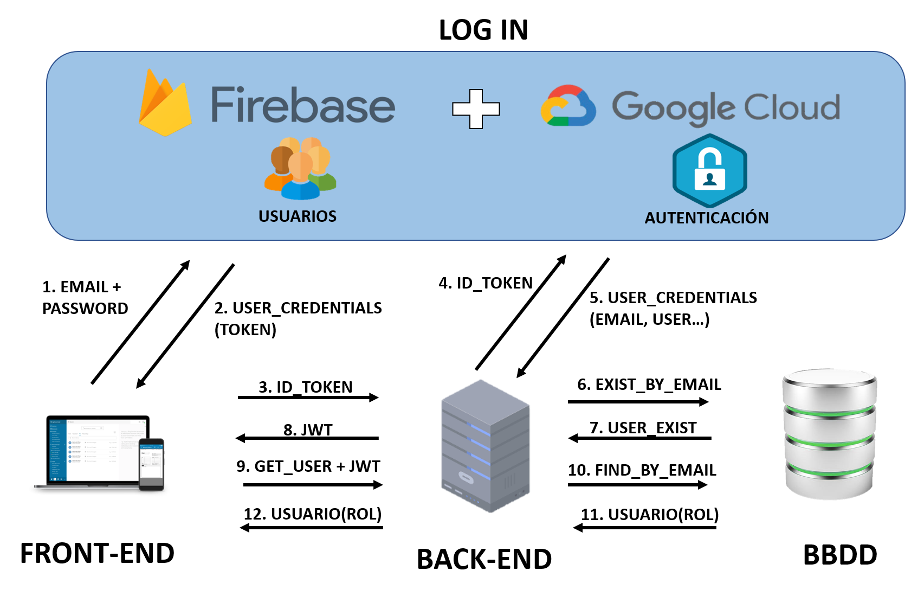

# Autenticación con Firebase y Jason Web Token (JWT)

## Descripción general

Se trata de un proyecto de una aplicación con un Backend API REST HATEOAS y un Frontend con Angular 8. La arquitectura de la seguridad es la siguiente:

 <p align="center">
  
</p>

Seguridad API: Spring Security y JWT.

Login con usuario y contraseña: Firebase (Google Cloud).

El registro de usuarios lo hace el administrador.

Se ha creado una clase productos como ejemplo con los siguientes permisos:

- ADMIN: CRUD Productos.

- USER: READ Productos.

## Crear Proyecto en Firebase

1. Accedemos a la consola de Firebase con nuestro email de google: [Consola_Firebase](https://console.firebase.google.com/).
2. Agregamos un proyecto.
3. Click en "Authentication" en el menu lateral.
4. Click en Comenzar.
5. En "Agrega tu primer método de acceso y comienza a utilizar Firebase Auth" agregamos "Correo electrónico/contraseña" (lo habilitamos).
6. Volvemos a la pagina principal del proyecto (click en "Descripción general del proyecto") y agregamos Firebase a nuestra app (click en simbolo WEB).
7. Nombramos nuestra app y click en "Registrar".


## Instalación de firebase

### En el Front:

En la consola de nuestro ordenador y en la carpeta de nuestro proyecto:

`npm install firebase --save`

Cambiamos la versión de Firebase en package.json: 

```
"dependencies": {
   
    "firebase": "^8.10.0"
    
  }
  ```
  
  Reinstalamos las dependencias:
  
  `npm install`
  
  En la carpeta enviroments creamos el archivo firebase.ts con la configuración de nuestro proyecto Firebase. Esta información se encuentra en el icono ⚙️ al lado de "Descripción general del proyecto" > "configuración del proyecto".
  
  
 <p align="center">
  
</p>
  
  
  ```
  export const firebaseConfig = {
  
    apiKey: "XXXXXXXXXXXXXXXXXXXX",
    authDomain: "xxxxxxxxxxxxx.firebaseapp.com",
    projectId: "xxxxxxxxxxxxxxxxx",
    messagingSenderId: "xxxxxxxxxx",
    appId: "xxxxxxxxxxxxxxxxxxxxxxxxxxxxx",
    measurementId: "xxxxxxxxxxxxxxxx"
    
 };
 ```

Estas claves son privadas. Añadir a gitignore antes de subir a github.


### En la API:

En build.gradle:

```
dependencies {
  ...
  implementation 'com.google.firebase:firebase-admin:8.1.0'
  implementation 'com.google.api-client:google-api-client:1.30.9' 
  ...
  }
``` 

## Jason Web Token (JWT).

### En la API:

En build.gradle:

```
dependencies {
  ...
  implementation 'org.springframework.boot:spring-boot-starter-security:2.5.5'	
  implementation 'io.jsonwebtoken:jjwt:0.9.1'
  
  testImplementation 'org.springframework.security:spring-security-test'
  ...
  }
``` 

#### Paquete JWT

JWTEntryPoint

Clase que impleneta AuthenticationEntryPoint de Spring Security y que se encarga de lanzar una excepción cuando la llamada HTTP recibida no contiene en su cabecera un token. Es un primer filtro de formato de llamada con token.

JWTProvider

Clase que gestiona las operaciones internas con los token. Creación de un token, extraer un email de un token o verificar un token.

JWTFilter

Clase que gestiona las llamadas HTTP recibidas comprobando si contienen un token válido. Contiene un método "doFilterInternal" qie se ejecuta con cualquier llamada HTTP. Extrae el token y lo comprueba con la clase JWTProvider. Si es válido crea un "SecurityContext" del usuario autenticado. 


#### OauthController

Es el unico punto de acceso que no está securizado. Este controlador recibe una llamada para autenticarse con un token de Firebase, lo verifica con Google y devuelve un JWT creado por JWTProvider. Este token se adjuntará a las sucesivas llamadas HTTP del Front.


